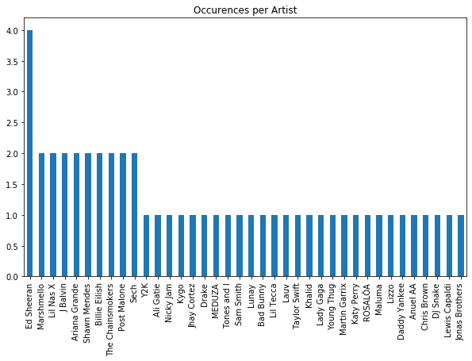
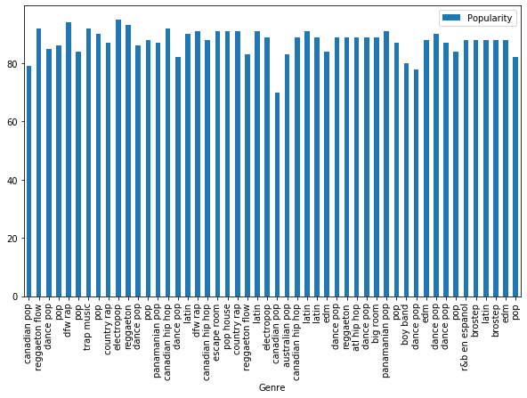
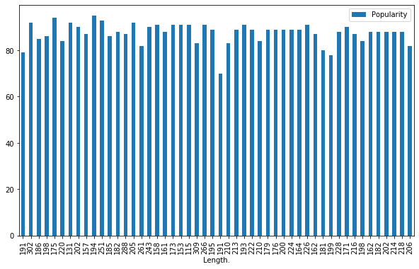
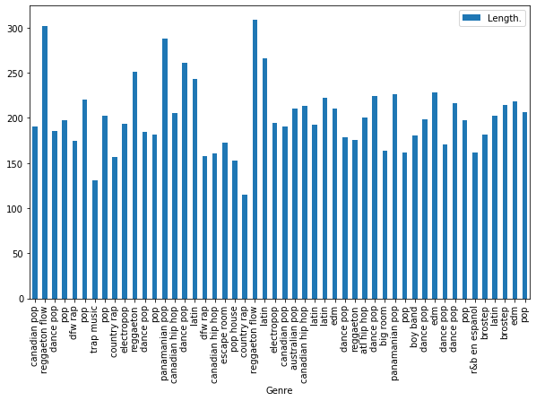

PLEASE look at the document in light mode to see the x and y axis labels of the graphs.

Run all code in order from top to bottom to ensure that there is no error in compiling and execution.

Make sure that the Seaborn package is installed. 

Run if not installed: pip install seaborn


Trends in Spotify’s Top 50 Songs of 2019 

About us
- Adam Scott - AdamScott6
- Baron Schitka - Baron242
- Ashvin Kuruparan - AshvinKuruparan2
- Jimmy Kesikiadis - DimitiosK1000

Introduction:

Music is incredibly diverse with countless genres, musicians, and countries of origin, but are there certain factors that make one song more popular than others? Is there a way to predict if a song will be a hit or not? Could you create a song that is statistically more likely to be popular? Creating a guaranteed smash hit may be impossible, but why not have the odds in your favour? Throughout history, there have been an endless amount of songs that have achieved this. Throughout this report, we will explore the different measurable metrics to find which variables correlate to popularity. So you, an aspiring musician, will learn how to become the next pop icon of our time. The data set that this report is analyzing, is provided by Spotify and includes information about the top 50 most popular songs on the platform during the year of 2019. There were various aspects of music that were identified and thus included such as energy, danceability, loudness, and many more. Based on the popularity of the songs, they were then ranked based on a set scale per category. As we continue on, we will break down each of these aspects and how it affects the popularity of a song. 


Discussion:

Within the data set, there are many different variables that can be considered and analyzed when looking for what makes a song popular, some of these are more effective at this than others are. With this in mind, the categories that are the most important are genre, song length, number of occurrences per artist, and the relationship it shares with the popularity. One of the factors we checked was the relationship between genre and popularity. As a musician, it is important to establish a genre that fits you as a person in addition to appealing to the public. Genres are a way to categorize music by specific forms, styles and specific subject matter, and as a result there are countless genres that are taken into account when analyzing the data. There were 21 different genres in the top 50 songs on Spotify, including but not limited to pop, trap music, reggaeton flow, and r&b en espanol. Out of all these genres, some of which could be considered opposites of each other. With such a vast diversity in genres, it can be concluded that there is no correlation between genre and popularity. Therefore, there is more creative freedom that can be taken with your discography as a musician, while having the same potential to become a hit. Another variable that is shown to contribute to the popularity of a song is the number of previous hits by that artist. If an artist has multiple songs in the top 50, it is more likely for another song to become popular. Ultimately, it does not have an affect on whether any music you make may end up becoming a hit. However, on average, when multiple songs by the same artist are on the top 50 chart, they are less popular than a single song by another artist. The artist with the most occurrences was Ed Sheeran, who only had 4 songs. Meanwhile 9 artists had two songs, and the remaining 40 had 1 song each. Contrary to my belief, song length does not have a correlation to how popular a song is. There is no clear trend of longer songs being more popular than shorter songs and vice versa, while looking at the rankings of the chart. Therefore, there is no minimum or maximum length that a song can be when it is considered a hit on the charts. From what this dataset shows, it seems that Reggaeton Flow, Latin and Pop music all have the highest length of songs.


```python
artist_counts = data['Artist.Name'].value_counts()
artist_counts.plot.bar(title='Occurences per Artist', figsize=(10,6))
```


    <matplotlib.axes._subplots.AxesSubplot at 0x7f985f42fb50>





```python
data.plot.bar(x='Genre', y='Popularity', figsize=(10,6))
```


    <matplotlib.axes._subplots.AxesSubplot at 0x7f986002ee90>





```python
data.plot.bar(x='Length.', y='Popularity', figsize=(10,6))
```


    <matplotlib.axes._subplots.AxesSubplot at 0x7f9860308410>





```python
data.plot.bar(x='Genre', y='Length.', figsize=(10,6))
```


    <matplotlib.axes._subplots.AxesSubplot at 0x7f9860567fd0>





Conclusion:

Many aspects have been explored throughout this analysis which have helped create an idea of what can be done in order to create a hit within the music industry. After looking at the different relationships between genres, song length and occurrences on the chart per artist, it can be concluded that most of these metrics do not have an affect on what songs get popular except song occurrence per artist. The relationship between song length and popularity is non-existent and can be ruled out from the process of creating a hit. This can also be said for the relationship between popularity and the type of genre the song is categorized under. The exception of this conclusion is the number of appearances on the chart of one artist. This aspect varies as it is not only limited to where on the charts it places, but how many times this occurs. It was concluded that the more hits an artist has, the lower it is as a collective then if another artist has one hit that tops the chart. Now that this has been discovered, you can consider these aspects of music popularity when you create your future hit. Baron Schitkahas learned how better to create graphs using Seaborn and Matplot. Something that surprised him is the lack of correlation between Genre and popularity. Similarly Adam was surprised to find little correlation between BPM and energy. Some of the elements were not as useful as others, a common complaint was that for the Popularity element it was not a ranking but a rating out of 100. For example, there were multiple songs with the same popularity rating from 86-92. Elements like Danceability, Speechiness and Liveness were not as useful for data analysis as elements like Song name and Artist name.


Acknowledgements:

This project was submitted as the final course project for CSCI 2000U “Scientific Data Analysis” during Fall 2021. The authors certify that the work in this repository is original and that all appropriate resources are rightfully cited.


```python

```
